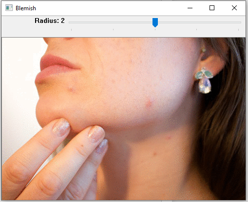

# Blemish Filter

The blemish filter is a mini project I did as part of my OpenCV online course work.

The project utilizes OpenCV's high GUI to create an app and a trackbar that increases the search radius of the best radius x radius

### How it works
It uses a trackbar, the search radius is actually 15 + 5*`trackbar_value`, this is due to OpenCV's trackbar limitations, it always starts at 0.

### When you click the left mouse button in the image, it calls `EventMouseClick`

1. It obtains a large slice of the neighborhood -> `2xradius left`, `2xradius right`, `2xradius up`, `2xradius down` from center of mouse click
2. Convert this neighborhood to grayscale(feeding it a grayscale image makes the edge detection faster).
3. A `radius x radius` grayscale image if fed to a scoring system. The `best_score` has the smoothest surface(the least amount of laplacian edges detected). The scoring system is the sum of modified laplacian.
4. We replace the `radius x radius` patch with the best neighbor using `seemlessCloning`

### Resulting images

Before

After

